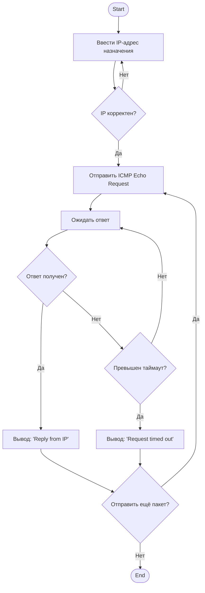
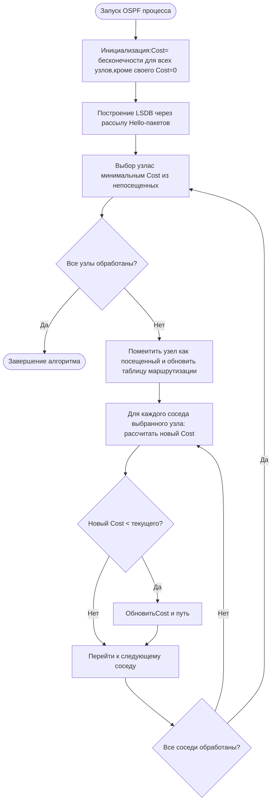
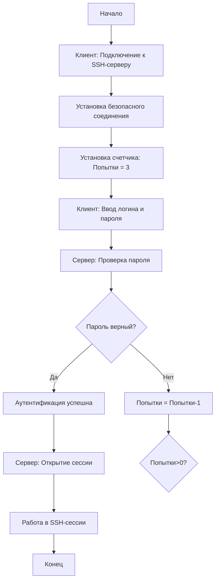
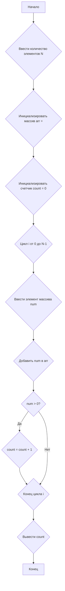

###### ОТЧЕТ ПО 2 ЛАБОРАТОРНОЙ РАБОТЕ ######
#### Задание 1.

Напишите блок схему отправки ping с устройства на устройство.

**Условия**: В блок схеме должно быть: 
- блоки ввода данных для ip
- как минимум один цикл
- блок вывода данных

#### Задание 2.

Вспомните как работает протокол ospf, а в частности его алгоритм поиска кратчайшего пути. Составьте блок-схему отправки сообщения с одного устройства до другого, которые объединены несколькими маршрутизаторами с ospf протоколом.

**Условия**: В блок схеме должно быть: 
- должно быть как минимум одно условие
- должен быть как минимум один цикл
- должна быть как минимум одна определённая переменная

#### Задание 3.

Вспомним как работает протокол ssh. Составим блок-схему подключения одного узла к другому через ssh

**Условия**: 
- Должно быть условие проверки пароля
- У пользователя есть 3 попытки ввода пароля
- Должны быть блоки ввода и вывода информации

#### Вариант 4
Подсчитать количество положительных чисел в массиве из N целых элементов.

*Пояснение*: Требуется пройти по каждому элементу массива в цикле и проверять его с помощью условия. (Создайте переменную для подсчета чисел с помощью блока процесса)

